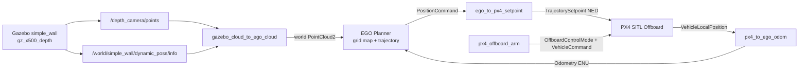

# EGO Planner + PX4 SITL 单墙避障演示

本仓库保存一套已经在 Ubuntu 24.04 / ROS 2 Jazzy 上跑通的最小演示：Gazebo 深度点云进入 EGO Planner，EGO 生成的位置轨迹经自写 ROS 2 bridge 转换为 PX4 Offboard 位置设定值，最终让 `gz_x500_depth` 绕过单墙并到达目标。

仓库只包含自写 bridge、演示 world、运行说明和成功视频，不包含 PX4-Autopilot 或 ego-planner-swarm 的完整源码。

## 成功视频

[查看 56 秒单墙避障演示（MOV，约 72 MiB）](images/wall_avoidance_demo.MOV)

- 画面：1920 × 1440，30 FPS
- 视频编码：HEVC
- SHA-256：`85d0c1d0b1d82ffef95c9e6a94fe5f63e6ebdd98a1b4732d7e8f291c17558aa1`

## 系统架构



更细的消息与坐标关系见 [docs/architecture.md](docs/architecture.md)。

## 仓库内容

```text
ego_px4_sitl_demo/
├── README.md
├── docs/
├── ego_px4_bridge/
├── images/wall_avoidance_demo.MOV
├── scripts/check_topics.sh
└── worlds/simple_wall.sdf
```

4 个核心节点：

- `px4_to_ego_odom.py`：PX4 本地位置 NED → EGO 里程计 ENU。
- `gazebo_cloud_to_ego_cloud.py`：深度点云利用 Gazebo Ground Truth Pose 转到 `world`，抽样并滤除地面点。
- `ego_to_px4_setpoint.py`：EGO `PositionCommand` ENU → PX4 `TrajectorySetpoint` NED；解锁后先悬停 6 秒，再跟轨迹；yaw 跟随水平速度方向。
- `px4_offboard_arm.py`：以 20 Hz 发布 Offboard 心跳，并在启动后 1～5 秒重复请求 Offboard 与 Arm。

## 环境依赖

已验证环境：

- Ubuntu 24.04
- ROS 2 Jazzy
- Gazebo Sim（由 PX4 SITL 使用）
- Python 3、NumPy
- [PX4-Autopilot](https://github.com/PX4/PX4-Autopilot)
- [ego-planner-swarm `ros2_version`](https://github.com/ZJU-FAST-Lab/ego-planner-swarm/tree/ros2_version)
- `px4_msgs`（消息定义必须与所用 PX4 版本匹配）
- `px4_ros_com`
- `ros_gz_bridge`
- `quadrotor_msgs`、`nav_msgs`、`sensor_msgs`、`sensor_msgs_py`、`tf2_msgs`
- Micro XRCE-DDS Agent（命令名 `MicroXRCEAgent`）

> `px4_msgs` 版本不匹配可能导致 topic 带 `_v1`、`_v4` 后缀或字段定义不同。请先用 `ros2 topic list` 和 `ros2 interface show` 对照本仓库代码。

## 构建 bridge

假设本仓库位于 `~/ego_px4_sitl_demo`，且 `px4_msgs`、`quadrotor_msgs` 已在同一工作区或已安装：

```bash
mkdir -p ~/ego_px4_bridge_ws/src
cp -r ~/ego_px4_sitl_demo/ego_px4_bridge ~/ego_px4_bridge_ws/src/
cd ~/ego_px4_bridge_ws
source /opt/ros/jazzy/setup.bash
colcon build --symlink-install
```

将 world 安装到 PX4：

```bash
cp ~/ego_px4_sitl_demo/worlds/simple_wall.sdf \
  ~/drone_ws/px4_clean/Tools/simulation/gz/worlds/simple_wall.sdf
```

本演示还对 PX4 的 `Tools/simulation/gz/models/OakD-Lite/model.sdf` 做过本地性能优化，但该 PX4 文件没有复制进仓库：关闭 IMX214 RGB 相机、保留 depth camera，并将 depth 分辨率调为 `80x60`，同时调整 `update_rate` 与 `clip far`。原始 RGB + depth 曾令 RTF 降至约 0.04～0.05；关闭 RGB 后恢复到约 1.0。

## 启动步骤

每段命令在独立终端运行，顺序如下。

### 1. PX4 + Gazebo

```bash
cd ~/drone_ws/px4_clean
HEADLESS=1 PX4_GZ_WORLD=simple_wall \
PX4_GZ_MODEL_POSE="-1,0.2,0,0,0,0" \
make px4_sitl gz_x500_depth
```

### 2. Micro XRCE-DDS Agent

```bash
MicroXRCEAgent udp4 -p 8888
```

### 3. 深度点云 bridge

```bash
source /opt/ros/jazzy/setup.bash
ros2 run ros_gz_bridge parameter_bridge \
  /depth_camera/points@sensor_msgs/msg/PointCloud2[gz.msgs.PointCloudPacked
```

### 4. Gazebo dynamic pose bridge

```bash
source /opt/ros/jazzy/setup.bash
ros2 run ros_gz_bridge parameter_bridge \
  /world/simple_wall/dynamic_pose/info@tf2_msgs/msg/TFMessage[gz.msgs.Pose_V
```

### 5. EGO Planner

```bash
source /opt/ros/jazzy/setup.bash
source ~/ego_jazzy_ws/install/setup.bash
ros2 launch ego_planner single_run_in_sim.launch.py
```

### 6. PX4 → EGO odom

```bash
source /opt/ros/jazzy/setup.bash
source ~/ws_sensor_combined/install/setup.bash
source ~/ego_px4_bridge_ws/install/setup.bash
export PYTHONPATH=/usr/lib/python3/dist-packages:$PYTHONPATH
ros2 run ego_px4_bridge px4_to_ego_odom
```

### 7. Gazebo cloud → EGO cloud

```bash
source /opt/ros/jazzy/setup.bash
source ~/ws_sensor_combined/install/setup.bash
source ~/ego_px4_bridge_ws/install/setup.bash
export PYTHONPATH=/usr/lib/python3/dist-packages:$PYTHONPATH
ros2 run ego_px4_bridge gazebo_cloud_to_ego_cloud
```

### 8. EGO → PX4 setpoint

```bash
source /opt/ros/jazzy/setup.bash
source ~/ws_sensor_combined/install/setup.bash
source ~/ego_jazzy_ws/install/setup.bash
source ~/ego_px4_bridge_ws/install/setup.bash
export PYTHONPATH=/usr/lib/python3/dist-packages:$PYTHONPATH
ros2 run ego_px4_bridge ego_to_px4_setpoint
```

### 9. 确认规划线后请求 Offboard + Arm

```bash
source /opt/ros/jazzy/setup.bash
source ~/ws_sensor_combined/install/setup.bash
source ~/ego_px4_bridge_ws/install/setup.bash
export PYTHONPATH=/usr/lib/python3/dist-packages:$PYTHONPATH
ros2 run ego_px4_bridge px4_offboard_arm
```

不要在 EGO 尚未产生有效规划线时提前解锁。

## Topic 数据流与目标频率

| 上游 | 下游 | 消息 | 目标频率 |
|---|---|---|---:|
| `/fmu/out/vehicle_local_position_v1` | `/drone_0_visual_slam/odom` | `VehicleLocalPosition → Odometry` | 约 50 Hz |
| `/depth_camera/points` | cloud bridge | `PointCloud2` | 约 10 Hz |
| cloud bridge | `/drone_0_pcl_render_node/cloud` | world 系点云 | 约 8～10 Hz |
| EGO | `/drone_0_grid/grid_map/occupancy_inflate` | 膨胀占据栅格 | 随地图更新 |
| EGO | `/drone_0_planning/pos_cmd` | `PositionCommand` | 规划器输出 |
| setpoint bridge | `/fmu/in/trajectory_setpoint` | `TrajectorySetpoint` | 20 Hz（目标 10～20 Hz） |
| arm bridge | `/fmu/in/offboard_control_mode` | `OffboardControlMode` | 20 Hz |

批量检查：

```bash
source /opt/ros/jazzy/setup.bash
./scripts/check_topics.sh
```

## 坐标系说明

PX4 本地位置使用 NED，ROS/EGO 使用 ENU：

```text
x_enu = y_ned
y_enu = x_ned
z_enu = -z_ned
```

发送 PX4 设定值时做逆向的同一轴交换；航向换算为：

```text
yaw_ned = π/2 - yaw_enu
```

点云不再使用 PX4 `vehicle_local_position.heading`。该 heading 在本次仿真中不可靠，会让 world 系点云漂移并产生“幽灵障碍物”。当前实现使用 Gazebo `/world/simple_wall/dynamic_pose/info` 的 Ground Truth Pose 完成刚体变换。

当前 odom bridge 的姿态四元数固定为单位四元数，只完成了位置与速度的 NED→ENU 换算；这是已知限制，不应直接照搬到依赖完整姿态的真机系统。

## RViz 建议

`Fixed Frame = world`，显示：

- `/drone_0_visual_slam/odom`
- `/drone_0_pcl_render_node/cloud`
- `/drone_0_grid/grid_map/occupancy_inflate`
- `/drone_0_planning/bspline`
- `/drone_0_planning/pos_cmd`

## 成功判据

- 点云不随飞机产生不合理漂移，地面点基本被过滤。
- 扫到墙时墙体点云出现，`occupancy_inflate` 与墙基本重合。
- EGO 能持续发布轨迹与 `pos_cmd`。
- Offboard 接管后先稳定悬停约 6 秒，再跟随规划轨迹。
- 机头随轨迹速度方向转动。
- 飞机绕过单墙、到达目标且不碰撞。

## 常见问题

- **没有 PX4 topic**：确认 `MicroXRCEAgent udp4 -p 8888` 正在运行，并检查 UDP 8888 端口。
- **topic 名不匹配**：不同 PX4/`px4_msgs` 版本可能改变后缀，按 `ros2 topic list` 修改订阅名。
- **点云漂移或出现幽灵墙**：确认 dynamic pose bridge 已启动；不要重新使用仿真中不可靠的 PX4 heading。
- **点云为空**：检查 `/depth_camera/points` 和 `/world/simple_wall/dynamic_pose/info` 是否都有数据。
- **地面进入 occupancy**：核对相机外参、`ground_z_min` 和 Gazebo world 坐标。
- **无法 Arm/进入 Offboard**：必须先连续发送 OffboardControlMode 与有效 setpoint；检查规划线和 PX4 preflight 日志。
- **RTF 很低**：关闭 OakD-Lite RGB 相机、降低 depth 分辨率与更新率，确认 RTF 回到可用范围。
- **机头低速抖动**：当前代码在水平速度低于 0.05 m/s 时保持上一次有效 yaw；检查速度噪声和阈值。

详细排障过程见 [docs/debug_log.md](docs/debug_log.md)。

## 后续计划

近期方向包括：完整姿态 NED↔ENU 转换、按 Gazebo 实体名选择 pose、参数化相机外参与滤波阈值、增加失联/超时/地理围栏等 failsafe，以及用 D455、MID360 + FAST-LIO2 替换仿真传感器。见 [docs/future_work.md](docs/future_work.md)。

面试复盘问题见 [docs/interview.md](docs/interview.md)。

## 许可

本仓库暂未附加开源许可证；除非仓库所有者另行授权，默认保留全部权利。
