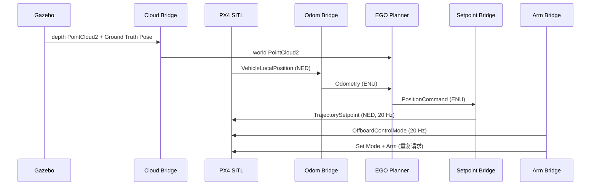
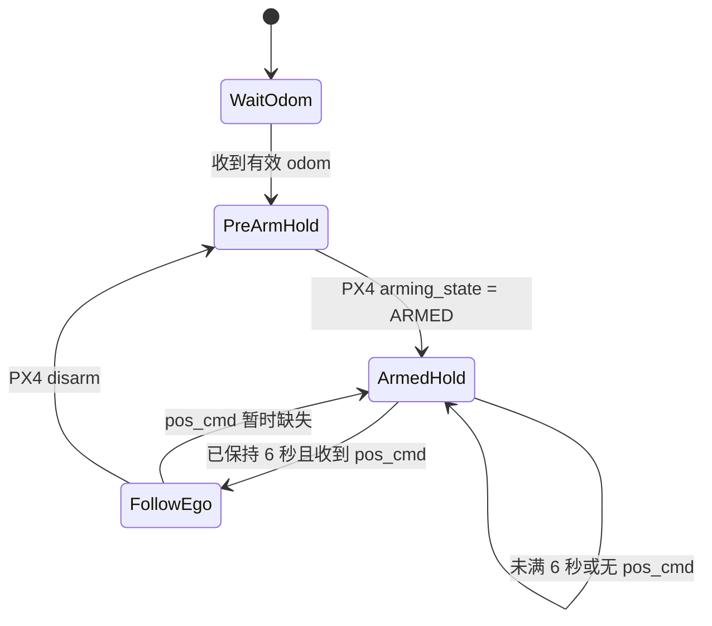

# 系统架构与接口说明

## 1. 设计目标

目标不是复制 PX4 或 EGO Planner，而是在两套系统之间提供最小、可解释、可独立复用的适配层：统一消息、坐标系、时间节奏和 Offboard 状态机。

## 2. 数据链路

## 3. 节点职责

### `px4_to_ego_odom`

- 订阅 `/fmu/out/vehicle_local_position_v1`，采用 PX4 兼容的 Best Effort / Volatile QoS。
- 检查 `xy_valid` 与 `z_valid`，无效数据不转发。
- 将位置和速度从 NED 换为 ENU。
- 发布 `/drone_0_visual_slam/odom`，`frame_id=world`、`child_frame_id=base_link`。
- 当前姿态固定为单位四元数；订阅的 `VehicleAttitude` 尚未用于完整姿态变换。

### `gazebo_cloud_to_ego_cloud`

- 同时接收 `/depth_camera/points` 与 `/world/simple_wall/dynamic_pose/info`。
- 使用相机相对机体平移 `[0.13233, 0, 0.26078]` 米与 Gazebo 四元数，把点从 camera/body-like frame 变换到 world。
- 保留 0.1～20 m 的点，每 5 点取 1 点，并过滤 `world z < 0.1 m` 的地面附近点。
- 发布 `frame_id=world` 的 `/drone_0_pcl_render_node/cloud`。

该实现根据实测确认 `/depth_camera/points` 使用 body-like 坐标，因此相机到机体的旋转取单位矩阵，而不是套用 REP-103 optical-frame 旋转。

### `ego_to_px4_setpoint`

- 缓存 EGO odom、`PositionCommand` 与 PX4 `VehicleStatus`。
- 未解锁或刚解锁 6 秒内，持续发布安全悬停点。
- 6 秒后有 EGO 命令就跟随轨迹，否则继续悬停。
- 以 20 Hz 发布 `TrajectorySetpoint`；未控制的速度、加速度、jerk、yawspeed 填 `NaN`。
- 水平速度大于 0.05 m/s 时，用 `atan2(vy, vx)` 更新 ENU yaw；低速时保持上次航向。

### `px4_offboard_arm`

- 以 20 Hz 连续发布 position-control 类型的 `OffboardControlMode`。
- 前 1 秒只建立 Offboard 信号流。
- 第 1～5 秒每 0.5 秒重复发送 Set Mode 与 Arm，减少一次性命令错过时机的问题。

## 4. 坐标换算

| 物理方向 | PX4 NED | ROS/EGO ENU |
|---|---|---|
| 北 | +X | +Y |
| 东 | +Y | +X |
| 上 | -Z | +Z |

因此位置/速度使用 `[y, x, -z]` 互换。yaw 采用 `yaw_ned = π/2 - yaw_enu`。

## 5. Offboard 时序

## 6. 边界与假设

- 这是 SITL 演示，不是可直接上真机的飞控安全层。
- Gazebo Ground Truth Pose 只适合仿真；真机应使用可靠状态估计器。
- dynamic pose 的 transform 顺序当前依赖仿真输出；更稳健的实现应按实体名筛选。
- 没有实现 setpoint/odom 超时触发、地理围栏、速度/加速度限幅、人工接管与独立急停。
- `px4_msgs` 必须与 PX4 版本一致，topic 名也必须现场核对。
